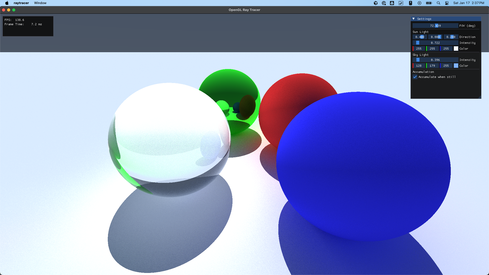

# GLSL Ray Tracer

This is a small personal project where I explore ray tracing directly in a
GLSL fragment shader. The C++ side is intentionally minimal: it just creates
an OpenGL window, feeds camera/light data to the shader, and accumulates frames
to help denoise.



## Features

- GLSL ray tracer with spheres, a ground plane, and basic materials
- Accumulation-based denoising when the camera is still
- ImGui controls for camera FOV, sun/sky lighting, and accumulation behavior
- First-person fly camera (mouse + WASD + Space/Shift)
- Cross platform (macOS, Linux, Windows)
- Simple CMake build

## Requirements

- CMake 3.28+
- C++17 compatible compiler
- OpenGL 4.1 core profile (macOS) or 3.3+ elsewhere

## Clone and Run Locally

This repo uses submodules for GLFW and ImGui, so make sure you clone with
`--recursive`:

```bash
git clone https://github.com/ypatel2022/ray-tracer-glsl --recursive
```

## Build and Run

### macOS / Linux

```bash
mkdir build
cd build
cmake ..
cmake --build .
./raytracer
```

### Windows (MinGW)

```bash
mkdir build
cd build
cmake -G "MinGW Makefiles" ..
cmake --build .
./raytracer.exe
```

## Controls

- `W/A/S/D` move
- `Space` / `Left Shift` up / down
- Mouse look (capture with `Tab`, release with `Tab`)
- `Esc` quit
